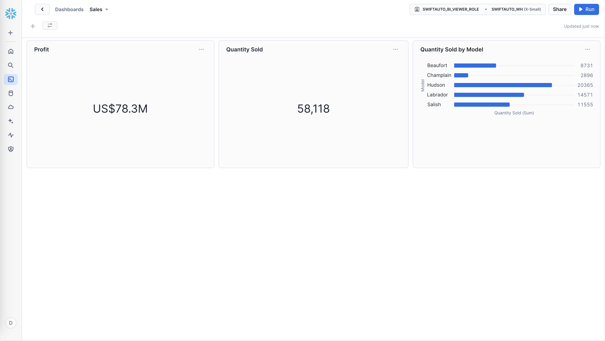
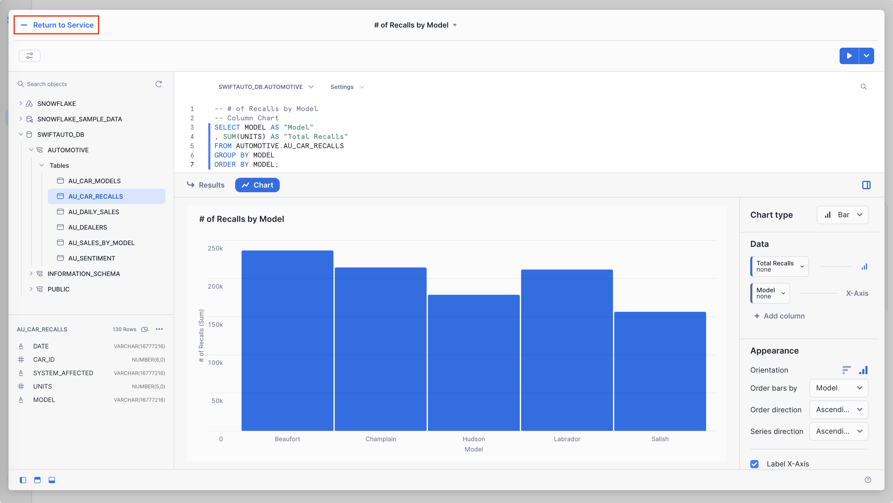
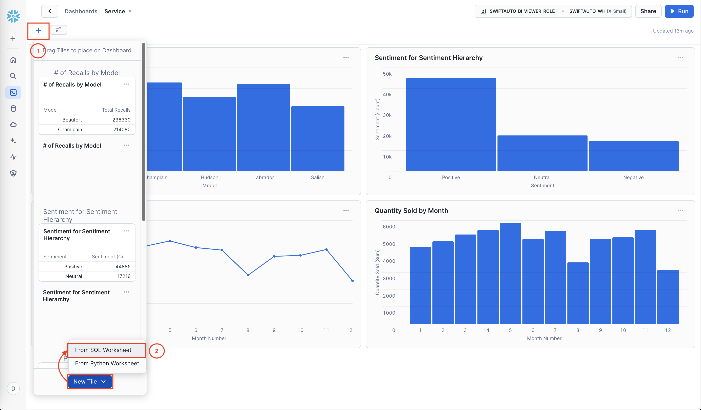
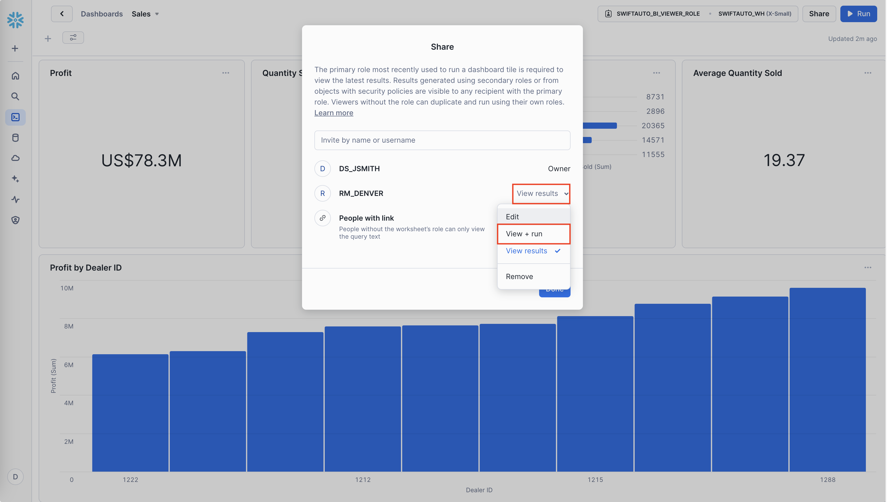
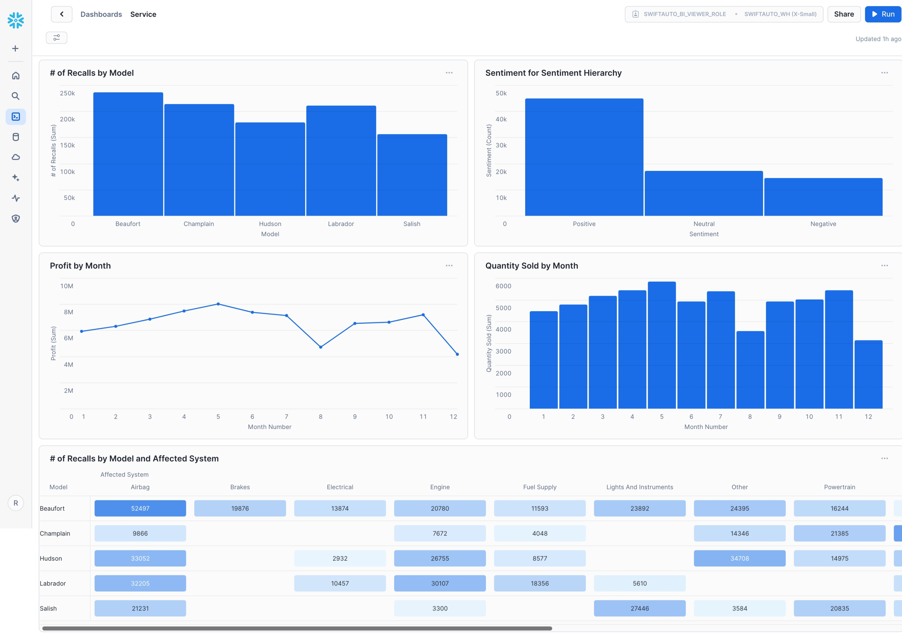

# Visualizing Car Sales and Dealer Profits Using Snowflake Snowsight

This project is based on the final assignment for the **[BI Dashboards with IBM Cognos Analytics and Google Looker](https://www.coursera.org/learn/bi-dashboards-with-ibm-cognos-analytics-and-google-looker)** course on Coursera. The original assignment focused on creating and analyzing business intelligence (BI) dashboards/reports using IBM Cognos Analytics and Google Looker Studio. However, for this project, I have modified the assignment to utilize Snowflake's Snowsight.

Snowsight currently supports the following types of charts:

* Bar chart
* Line chart
* Scatterplots
* Heat grids
* Scorecards

Due to the limited chart types available in Snowsight, suitable substitutions were made to effectively display the required KPIs.

<span style="color:yellow">*Before proceeding, please review and complete the setup steps outlined [here](./README.md/#requirements).*</span>

## Task Instructions

<u>Create two dashboards as follows:</u>

* One dashboard with 5 different visuals to develop a `Sales` dashboard.


* One dashboard with 4 different charts to represent a `Service` dashboard.


<u>Capture the following KPI metrics as visualizations:</u>

**[Task 1:](#task-1---create-a-sales-dashboard-to-capture-kpi-metrics)** On the `Sales` dashboard, capture the following KPI metrics:
* In the first small rectangle (`Panel 1`), capture `Profit` (formatted to 1 decimal place in millions of US dollars)
* In the second small rectangle (`Panel 2`), capture `Quantity sold`
* In the third small rectangle (`Panel 3`), capture `Quantity sold by model` (as a `bar chart`)
* In the fourth small rectangle (`Panel 4`), capture `Average quantity sold`

**[Task 2:](#task-2---develop-a-column-chart-to-display-profit-by-dealer-id-in-the-sales-dashboard-sorted-in-ascending-order)** On the `Sales` dashboard in the large rectangle (`Panel 5`), display `Profit by Dealer ID` as a `column chart` sorted in ascending order.

**[Task 3:](#task-3---create-a-service-dashboard-to-capture-kpi-metrics)** On the `Service` dashboard, capture the following KPI metrics as visualizations:
* In the top left area (`Panel 1`), capture the number of recalls per model of car (as a `column chart`)
* In the top right area (`Panel 2`), capture the customer sentiment by comparing positive, neutral, and negative reviews (as a `treemap`).
* In the bottom left area (`Panel 3`), capture the quantity of cars sold per month compared to the profit (as a `line and column chart`).
* In the bottom right area (`Panel 4`), capture the number of recalls by model and affected system (as a `heat map`). This will help us understand if there are any outliers for a given model or a specific system.

**[Task 4:](#task-4---share-dashboards)** Share dashboards


## Task 1 - Create a Sales dashboard to capture KPI metrics

To create a `Sales` dashboard, complete the following steps:

1. Log in to Snowsight using the `DS_JSMITH` account.

2. Navigate to the `Projects` section and then to `Dashboards`.

3. Click `+ Dashboard`.


4. Name the new dashboard `Sales` and click `Create Dashboard`.

5. Use the context selector to specify the `SWIFTAUTO_BI_VIEWER_ROLE` role and `SWIFTAUTO_WH` warehouse to use for running the queries in the dashboard.


### Add a tile to capture Profit (formatted to 1 decimal place in millions of US dollars)

To add a tile titled as `Profit` to the `Sales` dashboard, complete the following steps:

1. Select `New Tile`.

2. Select `From SQL Worksheet`.

A blank worksheet opens, overlaying the dashboard.

3. Use the context selector to specifiy the `SWIFTAUTO_DB` database and `AUTOMOTIVE` schema to use for running the SQL worksheet.


4. Rename the tile from the timestamp value to `Profit`.


5. Copy this query to the SQL worksheet, and then select the `Run` button.
    ```sql
    -- Profit
    -- formatted to 1 decimal place in millions of US dollars
    SELECT CONCAT('US$', TO_CHAR(SUM(profit) / 1000000, 'FM999999999.0'), 'M')
    AS "Profit"
    FROM AUTOMOTIVE.AU_SALES_BY_MODEL;
    ```

6. Select `Return to Sales` to save your worksheet and add it to the dashboard.


    The `Sales` dashboard will look like this:
    

### Add a tile to capture Quantity Sold

To add a tile titled as `Quantity Sold` to the `Sales` dashboard, complete the following steps:

1. Select `+` (+).

2. Select `New Tile` >> `From SQL Worksheet`

A blank worksheet opens, overlaying the dashboard.

3. Use the context selector to specifiy the `SWIFTAUTO_DB` database and `AUTOMOTIVE` schema to use for running the SQL worksheet.


4. Rename the tile from the timestamp value to `Quantity Sold`.


5. Copy this query to the SQL worksheet, and then select the `Run` button.
    ```sql
    -- Quantity Sold
    SELECT SUM(QUANTITY_SOLD) AS "Quantity Sold"
    FROM AUTOMOTIVE.AU_SALES_BY_MODEL;
    ```

6. Select `Return to Sales` to save your worksheet and add it to the dashboard.


    The `Sales` dashboard will look like this:
    

### Add a Tile to capture Quantity Sold by Model (as a bar chart)

To add a tile titled as `Quantity Sold by Model` to the `Sales` dashboard, complete the following steps:

1. Select `+` (+).

2. Select `New Tile` >> `From SQL Worksheet`

A blank worksheet opens, overlaying the dashboard.

3. Use the context selector to specifiy the `SWIFTAUTO_DB` database and `AUTOMOTIVE` schema to use for running the SQL worksheet.


4. Rename the tile from the timestamp value to `Quantity Sold by Model`.


5. Copy this query to the SQL worksheet, and then select the `Run` button.
    ```sql
    -- Quantity Sold by Model
    SELECT MODEL AS "Model",
           SUM(QUANTITY_SOLD) AS "Quantity Sold (Sum)"
    FROM AUTOMOTIVE.AU_SALES_BY_MODEL
    GROUP BY MODEL
    ORDER BY MODEL;
    ```
    

6. Above the results table for the query, select `Chart`, and then modify the chart attributes as follows:
    * Chart type: Bar
    * Orientation: Horizontal
    * Order bars by: Model
    * Order direction: Ascending
    * Label X-Axis: Quantity Sold (Sum)
    * Label Y-Axis: Model

7. Select `Return to Sales` to save your worksheet and add it to the dashboard.


8. By default, tiles are added to the bottom of the dashboard. Drag the `Quantity Sold by Model` tile to the right of the `Quantity Sold` tile.


    The `Sales` dashboard will look like this:
    

### Add a Tile to capture Average Quantity Sold

To add a tile titled as `Average Quantity Sold` to the `Sales` dashboard, complete the following steps:

1. Select `+` (+).

2. Select `New Tile` >> `From SQL Worksheet`

A blank worksheet opens, overlaying the dashboard.

3. Use the context selector to specifiy the `SWIFTAUTO_DB` database and `AUTOMOTIVE` schema to use for running the SQL worksheet.


4. Rename the tile from the timestamp value to `Average Quantity Sold`.


5. Copy this query to the SQL worksheet, and then select the `Run` button.
    ```sql
    -- Average Quantity Sold
    SELECT ROUND(AVG(QUANTITY_SOLD), 3) AS "Average Quantity Sold"
    FROM AUTOMOTIVE.AU_SALES_BY_MODEL;
    ```

6. Select `Return to Sales` to save your worksheet and add it to the dashboard.


7. By default, tiles are added to the bottom of the dashboard. Drag the `Average Quantity Sold` tile to the right of `Quantity Sold by Model`


    The `Sales` dashboard will look like this:
    


## Task 2 - Develop a column chart to display Profit by Dealer ID in the Sales dashboard sorted in ascending order

To add a tile titled as `Profit by Dealer ID` to the `Sales` dashboard, complete the following steps:

1. Select `+` (+).

2. Select `New Tile` >> `From SQL Worksheet`

A blank worksheet opens, overlaying the dashboard.

3. Use the context selector to specifiy the `SWIFTAUTO_DB` database and `AUTOMOTIVE` schema to use for running the SQL worksheet.


4. Rename the tile from the timestamp value to `Profit by Dealer ID`.


5. Copy this query to the SQL worksheet, and then select the `Run` button.
    ```sql
    -- Profit by Dealer ID
    -- sorted in ascending order (column chart)
    SELECT DEALER_ID AS "Dealer ID",
        SUM(PROFIT) AS "Profit (Sum)"
    FROM AUTOMOTIVE.AU_SALES_BY_MODEL
    GROUP BY DEALER_ID
    ORDER BY SUM(PROFIT) ASC;
    ```
    

6. Above the results table for the query, select `Chart`, and then modify the chart attributes as follows:
    * Chart type: Bar
    * Orientation: Vertical
    * Order bars by: Bar size
    * Order direction: Ascending
    * Label X-Axis: Dealer ID
    * Label Y-Axis: Profit (Sum)

7. Select `Return to Sales` to save your worksheet and add it to the dashboard.


8. By default, tiles are added to the bottom of the dashboard. Resize the `Profit by Dealer ID` tile.

    The `Sales` dashboard will look like this:
    


## Task 3 - Create a Service dashboard to capture KPI metrics

To create a `Service` dashboard, complete the following steps:

1. Navigate to the `Projects` section and then to `Dashboards`.

2. Click `+ Dashboard`.


3. Name the new dashboard `Service` and click `Create Dashboard`.

4. Use the context selector to specify the `SWIFTAUTO_BI_VIEWER_ROLE` role and `SWIFTAUTO_WH` warehouse to use for running the queries in the dashboard.


### Add a tile to capture the number of recalls per model of car (as a column chart)

To add a tile titled as `# of Recalls by Model` to the `Service` dashboard, complete the following steps:

1. Select `New Tile`.

2. Select `From SQL Worksheet`.

A blank worksheet opens, overlaying the dashboard.

3. Use the context selector to specifiy the `SWIFTAUTO_DB` database and `AUTOMOTIVE` schema to use for running the SQL worksheet.


4. Rename the tile from the timestamp value to `# of Recalls by Model`.


5. Copy this query to the SQL worksheet, and then select the `Run` button.
    ```sql
    -- # of Recalls by Model
    -- Column Chart
    SELECT MODEL AS "Model"
    , SUM(UNITS) AS "Total Recalls"
    FROM AUTOMOTIVE.AU_CAR_RECALLS
    GROUP BY MODEL
    ORDER BY MODEL;
    ```
    

6. Above the results table for the query, select `Chart`, and then modify the chart attributes as follows:
    * Chart type: Bar
    * Orientation: Vertical
    * Order bars by: Model
    * Order direction: Ascending
    * Label X-Axis: Model
    * Label Y-Axis: # of Recalls (Sum)

7. Select `Return to Sales` to save your worksheet and add it to the dashboard.


    The `Service` dashboard will look like this:
    

### Add a tile to capture the customer sentiment by comparing positive, neutral, and negative reviews (as a treemap)

<span style="color:yellow">*Snowsight does not support treemaps, so a column chart will be used to show the count of each sentiment.*</span>

To add a tile titled as `Sentiment for Sentiment Hierarchy` to the `Service` dashboard, complete the following steps:

1. Select `+` (+).

2. Select `New Tile` >> `From SQL Worksheet`

A blank worksheet opens, overlaying the dashboard.

3. Use the context selector to specifiy the `SWIFTAUTO_DB` database and `AUTOMOTIVE` schema to use for running the SQL worksheet.


4. Rename the tile from the timestamp value to `Sentiment for Sentiment Hierarchy`.


5. Copy this query to the SQL worksheet, and then select the `Run` button.
    ```sql
    -- Sentiment for Sentiment Hierarchy
    SELECT SENTIMENT AS "Sentiment",
           COUNT(*) AS "Sentiment (Count)"
    FROM AUTOMOTIVE.AU_SENTIMENT
    GROUP BY SENTIMENT
    ORDER BY "Sentiment (Count)" DESC;
    ```
    

6. Above the results table for the query, select `Chart`, and then modify the chart attributes as follows:
    * Chart type: Bar
    * Orientation: Vertical
    * Order bars by: Bar size
    * Order direction: Descending
    * Label X-Axis: Sentiment
    * Label Y-Axis: Sentiment (Count)

7. Select `Return to Sales` to save your worksheet and add it to the dashboard.


    The `Service` dashboard will look like this:
    

### Add a tile to capture the quantity of cars sold per month compared to the profit (as a line and column chart)

<span style="color:yellow">*Snowsight does not currently support a combination line and column chart, so a separate line chart will be used to show profit per month alongside a column chart to show the quantity of cars sold per month.*</span>

To add a tile titled as `Profit by Month` to the `Service` dashboard, complete the following steps:

1. Select `+` (+).

2. Select `New Tile` >> `From SQL Worksheet`

A blank worksheet opens, overlaying the dashboard.

3. Use the context selector to specifiy the `SWIFTAUTO_DB` database and `AUTOMOTIVE` schema to use for running the SQL worksheet.


4. Rename the tile from the timestamp value to `Profit by Month`.


5. Copy this query to the SQL worksheet, and then select the `Run` button.
    ```sql
    -- Profit and Quantity Sold by Month
    SELECT MONTH AS "Month",
        MONTH(DATE) AS "Month Number",
        SUM(QUANTITY_SOLD) AS "Quantity Sold (Sum)",
        SUM(PROFIT) AS "Profit (Sum)"
    FROM AUTOMOTIVE.AU_SALES_BY_MODEL
    GROUP BY MONTH,
        MONTH(DATE)
    ORDER BY MONTH(DATE);
    ```
    

    <span style="color:yellow">*Although the query results are in the correct order, when charting, Snowsight does not recognize the custom ordering of month names. To address this we will use the `Month Number` column for ordering.*</span>

6. Above the results table for the query, select `Chart`, and then modify the chart attributes as follows:
    * Chart type: Line
    * Data: Profit (Sum); Use as: Line
    * Data: Month Number; Use as: X-Axis
    * Fill area: Unchecked
    * Show points: Checked
    * Label X-Axis: Month Number
    * Label Y-Axis: Profit (Sum)

7. Select `Return to Sales` to save your worksheet and add it to the dashboard.


    The `Service` dashboard will look like this:
    

Next, duplicate the `Profit by Month` tile to add a tile titled as `Quantity Sold by Month` to the `Service` dashboard by completing the following steps:

8. From the `Profit by Month` tile menu (`∙∙∙`), select `Duplicate Tile`.

A copy of the `Profit by Month` tile appears at the bottom of the dashboard.

9. From the `Copy of Profit by Month` tile menu (`∙∙∙`), select `Edit Query`.


10. Rename the tile from `Copy of Profit by Month` to `Quantity Sold by Month`.


11. Select `Chart`, and then modify the chart attributes as follows:

    <span style="color:yellow">*As previously mentioned, Snowsight does not support custom ordering of month names. To address this we will use the `Month Number` column for ordering.*</span>

    * Chart type: Bar
    * Data: Quantity Sold (Sum); Use as: Bar
    * Orientation: Vertical
    * Order bars by: Month Number
    * Order direction: Ascending
    * Label X-Axis: Month number
    * Label Y-Axis: Quantity Sold (Sum)

12. Select `Return to Sales` to save your worksheet and add it to the dashboard.


    The `Service` dashboard will look like this:
    

### Add a tile to capture the number of recalls by model and affected system (as a heat map)

<span style="color:yellow">*Snowsight supports heat grids, which are similar to heat maps but not exactly the same. Both visualizations use colour to represent data, but heat grids are typically used for categorical data to compare distributions across multiple dimensions.*</span>

To add a tile titled as `# of Recalls by Model and Affected System` to the `Service` dashboard, complete the following steps:

1. Select `+` (+).

2. Select `New Tile` >> `From SQL Worksheet`

A blank worksheet opens, overlaying the dashboard.

3. Use the context selector to specifiy the `SWIFTAUTO_DB` database and `AUTOMOTIVE` schema to use for running the SQL worksheet.


4. Rename the tile from the timestamp value to `# of Recalls by Model and Affected System`.


5. Copy this query to the SQL worksheet, and then select the `Run` button.
    ```sql
    -- Recalls by Model and System Affected
    SELECT MODEL AS "Model",
        SYSTEM_AFFECTED AS "Affected System",
        SUM(UNITS) AS "# of Recalls (Sum)"
    FROM AUTOMOTIVE.AU_CAR_RECALLS
    GROUP BY MODEL,
        SYSTEM_AFFECTED;
    ```
    

6. Above the results table for the query, select `Chart`, and then modify the chart attributes as follows:
    * Chart type: Heatgrid
    * Data: # of Recalls (Sum); Use as: Cell value
    * Data: Model; Use as: Rows
    * Data: Affected System; Use as: Columns
    * Label rows: Model
    * Label columns: Affected System
    * Color cells based on value: Checked

7. Select `Return to Sales` to save your worksheet and add it to the dashboard.


8. By default, tiles are added to the bottom of the dashboard. Resize the `# of Recalls by Model and Affected System` tile.

    The `Service` dashboard will look like this:
    

    <span style="color:yellow">*The final assignment called for a `Service` dashboard featuring four distinct charts. However, due to Snowsight's limitations, we had to slightly adjust the layout to effectively capture the KPIs.*</span>
    
    Below is the complete `Service` dashboard:
    


## Task 4 - Share dashboards

<span style="color:yellow">*To view shared dashboards, the Snowflake user needs to be assigned the same role used in the session context for the queries powering the dashboard.*</span>

To share the `Sales` dashboard, complete the following steps:

1. Log in to Snowsight using the `DS_JSMITH` account.

2. Navigate to the `Projects` section and then to `Dashboards`.

3. Select `Sales`.


4. Click on the `Share` button.


    <span style="color:yellow">*Only users who have previously signed in to Snowsight are shown and can be assigned share permissions. Please ensure you log in to the RM_DENVER account before proceeding.*</span>

5. Enter the `RM_DENVER` username to invite the Denver Regional Manager to use the `Sales` dashboard.


6. Select the `View results` >> `View + run` permission level, which allows the `RM_DENVER` user to view the dashboard and run the queries but not make changes to the dashboard.


7. Optionally, select the appropriate permission level for `People with link`. Then, click `Get Link` to generate a shareable URL for the `Sales` dashboard that you can distribute to others.

8. Select `Done`.


Repeat these steps to share the `Service` dashboard.

9. Log in to Snowsight using the `RM_DENVER` account.

    The `RM_DENVER` account homepage will look like this:
    

10. Alternatively, navigate to the `Projects` section and then to `Dashboards`.

11. Select `Sales`.


    The `Sales` dashboard will look like this:
    

    Similarly, the `Service` dashboard will look like this:
    

    <span style="color:yellow">*Users granted `View + run` access to a shared dashboard can view the results and the queries that drive each tile from the tile menu (`∙∙∙`). They can re-run the queries in the dashboard to refresh the data, but they cannot edit the dashboard or change any of its properties.*</span>


**End of assignment**.


## Change Log

| Date (YYYY-MM-DD) | Version | Changed By | Change Description |
|---|---|---|---|
| 2024-10-11 | 0.1 | Pravin Regismond | Initial Version |
| 2024-11-17 | 0.2 | Pravin Regismond | Updated README.md reference to point to Requirements heading |