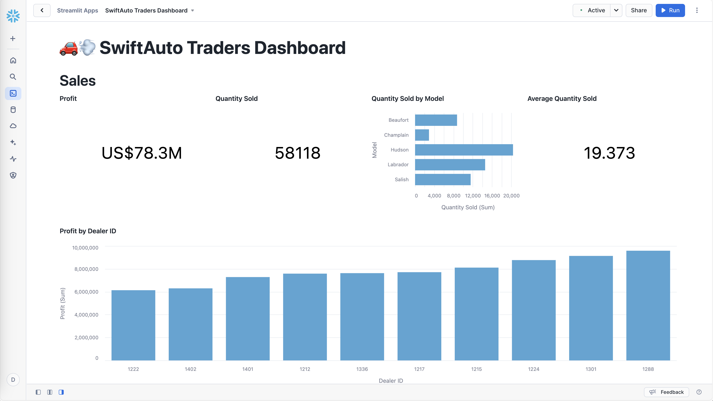
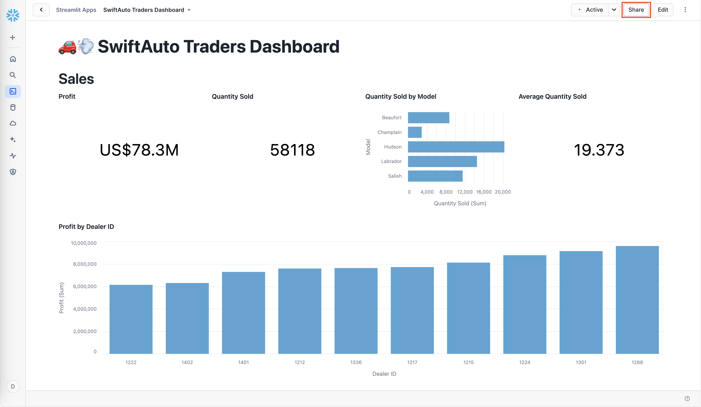
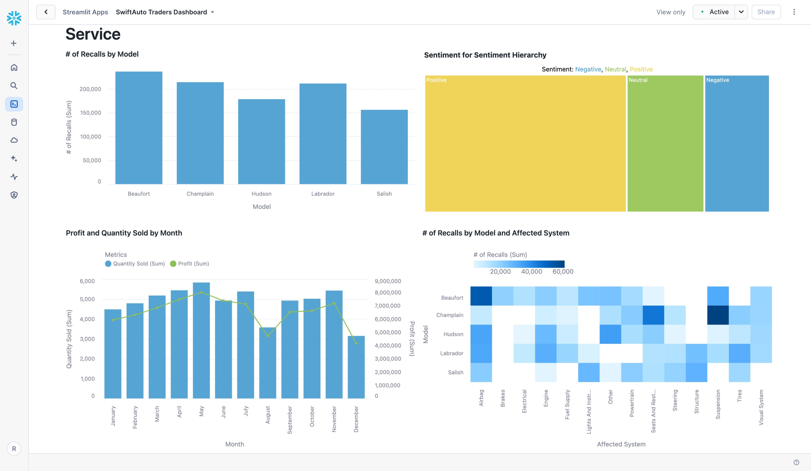

# Visualizing Car Sales and Dealer Profits Using Streamlit-in-Snowflake (SiS)

This project is based on the final assignment for the **[BI Dashboards with IBM Cognos Analytics and Google Looker](https://www.coursera.org/learn/bi-dashboards-with-ibm-cognos-analytics-and-google-looker)** course on Coursera. The original assignment focused on creating and analyzing business intelligence (BI) dashboards/reports using IBM Cognos Analytics and Google Looker Studio.

For this project, I created a Streamlit app to demonstrate alternative ways of creating visualizations in Snowflake and to address some of the limitations of Snowsight dashboards.

<span style="color:yellow">*Before proceeding, please review and complete the setup steps outlined [here](./README.md/#requirements).*</span>


## Create a Streamlit app to capture Sales and Service KPI metrics

To create a `SwiftAuto Traders Dashboard` Streamlit app, complete the following steps:

1. Log in to Snowsight using the `DS_JSMITH` account.

2. In the navigation menu, click on the `DS_JSMITH` username. 

3. Select the active role `DATA_SCIENTIST`.

4. From the role selector, select `SWIFTAUTO_BI_CREATOR_ROLE`.


    <span style="color:yellow">*The `SWIFTAUTO_BI_CREATOR_ROLE` has been granted only the necessary privileges to create Streamlit apps with `SELECT` access on existing `SWIFTAUTO_DB.AUTOMOTIVE` tables. The Streamlit app will run with the rights of this role. For more details on the privileges granted, see the [setup_swiftauto_traders.py](./setup_swiftauto_traders.py) script.*</span>

5. Navigate to the `Projects` section and then to `Streamlit`.

6. Click `+ Streamlit App`.


7. Enter `SwiftAuto Traders Dashboard` as the App title and click `Create`.


    <span style="color:yellow">*The `SWIFTAUTO_BI_CREATOR_ROLE` has been granted USAGE access to the `SWIFTAUTO_DB` database, `PUBLIC` schema, and `SWIFTAUTO_WH` warehouse. These have been populated for you in this modal window because the SWIFTAUTO_BI_CREATOR_ROLE only has USAGE access to these specific resources.*</span>

    The Streamlit in Snowflake editor will open with an example app.
    

    <span style="color:yellow">*The Streamlit in Snowflake interface has three panes: Object browser (for databases, schemas, and views), Streamlit editor (for Python code), and Streamlit preview (for rendering the application). To change the display, use the show/hide buttons in the lower-left corner.*</span>

8. Copy the code from the [streamlit_swiftauto_traders.py](./streamlit_swiftauto_traders.py) file. Replace the existing code in the Snowflake editor with the copied code.

    ```python
    """
    SCRIPT: streamlit_swiftauto_traders.py
    AUTHOR: Pravin Regismond
    DATE: 2024-10-25
    DESCRIPTION: This Streamlit app demonstrates how to create visualizations
                within Snowflake using Streamlit, offering an alternative to
                Snowsight dashboards and addressing some of their limitations.

    AUDIT TRAIL START                               INIT  DATE
    ----------------------------------------------  ----- -----------
    1. Initial version                              PR    2024-10-25

    AUDIT TRAIL END
    """

    # Import Python packages
    import streamlit as st
    import altair as alt
    import plotly.graph_objects as go
    from snowflake.snowpark.context import get_active_session

    # Get the current credentials
    session = get_active_session()

    # Streamlit app
    st.set_page_config(layout="wide")

    # Custom CSS to remove whitespace above the title
    st.markdown(
        """
        <style>
        .block-container {
            padding-top: 0rem;
        }
        </style>
        """,
        unsafe_allow_html=True
    )

    st.title(":car::dash: SwiftAuto Traders Dashboard")
    st.header("Sales")

    ######################################################################
    # Profit
    ######################################################################

    # Execute the SQL query to get the profit value
    profit_value = session.sql(
        """
        SELECT CONCAT('US$', TO_CHAR(SUM(profit) / 1000000, 'FM999999999.0'), 'M')
        AS "Profit"
        FROM AUTOMOTIVE.AU_SALES_BY_MODEL;
        """
    ).collect()[0]['Profit']

    # Create data directly for Altair
    profit_data = [{'Metric': 'Profit', 'Value': profit_value}]

    # Create a Profit scorecard in Altair
    profit_chart = alt.Chart(alt.Data(values=profit_data)).mark_text(
        align='center',
        baseline='middle',
        fontSize=40
    ).encode(
        x=alt.value(200),
        y=alt.value(100),
        text='Value:N'
    ).properties(
        width=300,
        height=300,
        title='Profit'
    )

    ######################################################################
    # Quantity Sold
    ######################################################################

    # Execute the SQL query to get the quantity sold value
    quantity_sold_value = float(session.sql(
        """
        SELECT SUM(QUANTITY_SOLD) AS "Quantity Sold"
        FROM AUTOMOTIVE.AU_SALES_BY_MODEL;
        """
    ).collect()[0]['Quantity Sold'])

    # Create data directly for Altair
    quantity_sold_data = [
        {'Metric': 'Quantity Sold', 'Value': quantity_sold_value}
    ]

    # Create a Quantity Sold scorecard in Altair
    quantity_sold_chart = alt.Chart(alt.Data(values=quantity_sold_data)).mark_text(
        align='center',
        baseline='middle',
        fontSize=40
    ).encode(
        x=alt.value(200),
        y=alt.value(100),
        text='Value:Q'
    ).properties(
        width=300,
        height=300,
        title='Quantity Sold'
    )

    ######################################################################
    # Quantity Sold by Model
    ######################################################################

    # Execute the SQL query and create a pandas dataframe
    quantity_sold_by_model_df = session.sql(
        """
        SELECT MODEL AS "Model",
            SUM(QUANTITY_SOLD) AS "Quantity Sold (Sum)"
        FROM AUTOMOTIVE.AU_SALES_BY_MODEL
        GROUP BY MODEL
        ORDER BY MODEL;
        """
    ).to_pandas()

    # Create a Quantity Sold by Model bar chart in Altair
    quantity_sold_by_model_chart = alt.Chart(quantity_sold_by_model_df).mark_bar(
        color='#55A4D4'
    ).encode(
        y=alt.Y(
            'Model:N',
            title='Model',
            sort=alt.EncodingSortField(field='Model', order='ascending')
        ),
        x=alt.X(
            'Quantity Sold (Sum):Q',
            title='Quantity Sold (Sum)'
        )
    ).properties(
        width=800,
        height=300,
        title='Quantity Sold by Model'
    )

    ######################################################################
    # Average Quantity Sold
    ######################################################################

    # Execute the SQL query to get the average quantity sold value
    average_quantity_sold_value = float(session.sql(
        """
        SELECT ROUND(AVG(QUANTITY_SOLD), 3) AS "Average Quantity Sold"
        FROM AUTOMOTIVE.AU_SALES_BY_MODEL;
        """
    ).collect()[0]['Average Quantity Sold'])

    # Create data directly for Altair
    average_quantity_sold_data = [
        {'Metric': 'Average Quantity Sold', 'Value': average_quantity_sold_value}
    ]

    # Create an Average Quantity Sold scorecard in Altair
    average_quantity_sold_chart = alt.Chart(
        alt.Data(values=average_quantity_sold_data)
    ).mark_text(
        align='center',
        baseline='middle',
        fontSize=40
    ).encode(
        x=alt.value(200),
        y=alt.value(100),
        text='Value:Q'
    ).properties(
        width=300,
        height=300,
        title='Average Quantity Sold'
    )

    # Display charts side by side
    col1, col2, col3, col4 = st.columns(4)
    col1.altair_chart(profit_chart, use_container_width=True)
    col2.altair_chart(quantity_sold_chart, use_container_width=True)
    col3.altair_chart(quantity_sold_by_model_chart, use_container_width=True)
    col4.altair_chart(average_quantity_sold_chart, use_container_width=True)

    ######################################################################
    # Profit by Dealer ID
    ######################################################################

    # Execute the SQL query and create a pandas dataframe
    profit_by_dealer_df = session.sql(
        """
        SELECT DEALER_ID AS "Dealer ID",
            SUM(PROFIT) AS "Profit (Sum)"
        FROM AUTOMOTIVE.AU_SALES_BY_MODEL
        GROUP BY DEALER_ID
        ORDER BY SUM(PROFIT) ASC;
        """
    ).to_pandas()

    # Create a Profit by Dealer ID column chart in Altair
    profit_by_dealer_chart = alt.Chart(profit_by_dealer_df).mark_bar(
        color='#55A4D4'
    ).encode(
        x=alt.X(
            'Dealer ID:N',
            title='Dealer ID',
            axis=alt.Axis(labelAngle=0),
            sort=alt.EncodingSortField(field='Profit (Sum)', order='ascending')
        ),
        y=alt.Y(
            'Profit (Sum):Q',
            title='Profit (Sum)'
        )
    ).properties(
        width='container',
        height=400,
        title='Profit by Dealer ID'
    )
    st.altair_chart(profit_by_dealer_chart, use_container_width=True)

    st.header("Service")

    ######################################################################
    # # of Recalls by Model
    ######################################################################

    # Execute the SQL query and create a pandas dataframe
    recalls_by_model_df = session.sql(
        """
        SELECT MODEL AS "Model"
        , SUM(UNITS) AS "Total Recalls"
        FROM AUTOMOTIVE.AU_CAR_RECALLS
        GROUP BY MODEL
        ORDER BY MODEL;
        """
    ).to_pandas()

    # Create a # of Recalls by Model column chart
    recalls_by_model_chart = alt.Chart(recalls_by_model_df).mark_bar(
        color='#55A4D4'
    ).encode(
        x=alt.X('Model:N', title='Model', axis=alt.Axis(labelAngle=0)),
        y=alt.Y('Total Recalls:Q', title='# of Recalls (Sum)')
    ).properties(
        width=800,
        height=370,
        title='# of Recalls by Model'
    )

    ######################################################################
    # Sentiment for Sentiment Hierarchy
    ######################################################################

    # Execute the SQL query and create a pandas dataframe
    sentiment_hierarchy_df = session.sql(
        """
        SELECT SENTIMENT AS "Sentiment",
            COUNT(*) AS "Sentiment (Count)"
        FROM AUTOMOTIVE.AU_SENTIMENT
        GROUP BY SENTIMENT
        ORDER BY "Sentiment (Count)" DESC;
        """
    ).to_pandas()

    # Create a Sentiment for Sentiment Hierarchy treemap in Plotly
    sentiment_hierarchy_chart = go.Figure(go.Treemap(
        labels=sentiment_hierarchy_df['Sentiment'],
        parents=[""] * len(sentiment_hierarchy_df),
        values=sentiment_hierarchy_df['Sentiment (Count)'],
        marker_colors=['#F0D359', '#9EC860', '#55A4D4'],
        textfont_color='white'
    ))

    # Add custom legend
    sentiment_hierarchy_chart.update_layout(
        title="Sentiment for Sentiment Hierarchy",
        width=800,
        height=370,
        margin={
            "l": 0,
            "r": 0,
            "t": 30,
            "b": 10
        },
        annotations=[
            {
                "text": (
                    "Sentiment: <span style='color:#55A4D4'>Negative</span>, "
                    "<span style='color:#9EC860'>Neutral</span>, "
                    "<span style='color:#F0D359'>Positive</span>"
                ),
                "showarrow": False,
                "x": 0.5,
                "y": 1,
                "xref": "paper",
                "yref": "paper",
                "font": {
                    "size": 14,
                    "color": "black"
                },
            }
        ]
    )

    # Display charts side by side
    col1, col2 = st.columns(2)
    col1.altair_chart(recalls_by_model_chart, use_container_width=True)
    col2.plotly_chart(sentiment_hierarchy_chart, use_container_width=True)

    ######################################################################
    # Profit and Quantity Sold by Month
    ######################################################################

    # Execute the SQL query and create a pandas dataframe
    profit_quantity_sold_by_month_df = session.sql(
        """
        SELECT MONTH AS "Month",
            MONTH(DATE) AS "Month Number",
            SUM(QUANTITY_SOLD) AS "Quantity Sold (Sum)",
            SUM(PROFIT) AS "Profit (Sum)"
        FROM AUTOMOTIVE.AU_SALES_BY_MODEL
        GROUP BY MONTH,
            MONTH(DATE)
        ORDER BY MONTH(DATE);
        """
    ).to_pandas()

    # Map month numbers to month names
    month_names = {
        1: 'January', 2: 'February', 3: 'March', 4: 'April', 5: 'May', 6: 'June',
        7: 'July', 8: 'August', 9: 'September', 10: 'October', 11: 'November',
        12: 'December'
    }
    profit_quantity_sold_by_month_df['Month Name'] = (
        profit_quantity_sold_by_month_df['Month Number'].map(month_names)
    )

    # Melt the data for easier plotting with a shared legend
    melted_data = profit_quantity_sold_by_month_df.melt(
        id_vars=['Month Name'],
        value_vars=['Quantity Sold (Sum)', 'Profit (Sum)'],
        var_name='Metric',
        value_name='Value'
    )

    # Create Profit and Quantity Sold by Month chart
    base = alt.Chart(melted_data).encode(
        alt.X('Month Name:N', title='Month', sort=list(month_names.values())),
        alt.Color('Metric:N', title='Metrics')
    )
    bar = base.mark_bar().encode(
        alt.Y('Value:Q', title='Quantity Sold (Sum)'),
        alt.Color(
            'Metric:N',
            title='Metrics',
            scale=alt.Scale(
                domain=['Quantity Sold (Sum)', 'Profit (Sum)'],
                range=['#55A4D4', '#8FBF54']
            )
        )
    ).transform_filter(
        alt.datum.Metric == 'Quantity Sold (Sum)'
    )
    line = base.mark_line(point=True).encode(
        alt.Y('Value:Q', title='Profit (Sum)'),
        alt.Color(
            'Metric:N',
            title='Metrics',
            scale=alt.Scale(
                domain=['Quantity Sold (Sum)', 'Profit (Sum)'],
                range=['#55A4D4', '#8FBF54']
            )
        )
    ).transform_filter(
        alt.datum.Metric == 'Profit (Sum)'
    )

    # Combine the bar and line charts with a legend
    profit_quantity_sold_by_month_chart = alt.layer(bar, line).resolve_scale(
        y='independent'
    ).properties(
        width=800,
        height=500,
        title='Profit and Quantity Sold by Month'
    ).configure_legend(
        labelFontSize=12,
        orient='top'
    )

    ######################################################################
    # # of Recalls by Model and Affected System
    ######################################################################

    # Execute the SQL query and create a pandas dataframe
    model_affected_system_df = session.sql(
        """
        SELECT MODEL AS "Model",
            SYSTEM_AFFECTED AS "Affected System",
            SUM(UNITS) AS "# of Recalls (Sum)"
        FROM AUTOMOTIVE.AU_CAR_RECALLS
        GROUP BY MODEL,
            SYSTEM_AFFECTED;
        """
    ).to_pandas()

    # Create pivot table
    pivot_table = model_affected_system_df.pivot_table(
        index='Model',
        columns='Affected System',
        values='# of Recalls (Sum)'
    )

    # Convert pivot table to long format
    pivot_long = pivot_table.reset_index().melt(
        id_vars='Model',
        value_name='# of Recalls (Sum)'
    )

    # Create heatmap
    model_affected_system_chart = alt.Chart(pivot_long).mark_rect().encode(
        x='Affected System:O',
        y='Model:O',
        color=alt.Color('# of Recalls (Sum):Q', legend=alt.Legend(orient='top'))
    ).properties(
        title='# of Recalls by Model and Affected System',
        width=800,
        height=500
    )

    # Display charts side by side
    col1, col2 = st.columns(2)
    col1.altair_chart(
        profit_quantity_sold_by_month_chart, use_container_width=True
    )
    col2.altair_chart(model_affected_system_chart, use_container_width=True)

    ```

9. At the top of the Streamlit editor, select `Packages` and enter `plotly` in the search text field.

10. Click `plotly`.


    <span style="color:yellow">*The `plotly` package is required to create a Sentiment for Sentiment Hierarchy treemap.*</span>

11. Click `Run`.


    The `SwiftAuto Traders Dashboard` Streamlit app will look like this:
    

    


## Share a Streamlit app

To share the `SwiftAuto Traders Dashboard` Streamlit app, complete the following steps:

1. Log in to Snowsight using the `DS_JSMITH` account.

2. Navigate to the `Projects` section and then to `Streamlit`.

3. Select `SwiftAuto Traders Dashboard`.


4. Click on the `Share` button.


5. Select the `REGIONAL_MANAGER` role to allow the regional managers to interact with the `SwiftAuto Traders Dashboard` Streamlit app.


    <span style="color:yellow">*Instead of granting access to the `SWIFTAUTO_BI_VIEWER_ROLE`, we'll provide access to regional managers using the `REGIONAL_MANAGER` functional role for this Streamlit app.*</span>

6. Select the `View only` permission level, which allows the regional managers to view the Streamlit app but not share with other roles.


7. Select `Done`.


8. Log in to Snowsight using the `RM_DENVER` account.

    The `RM_DENVER` account homepage will look like this:
    

9. Alternatively, navigate to the `Projects` section and then to `Streamlit`.

10. Select `SwiftAuto Traders Dashboard`.


    The `SwiftAuto Traders Dashboard` Streamlit app will look like this:
    

    


**End of assignment**.


## Change Log

| Date (YYYY-MM-DD) | Version | Changed By | Change Description |
|---|---|---|---|
| 2024-10-25 | 0.1 | Pravin Regismond | Initial Version |