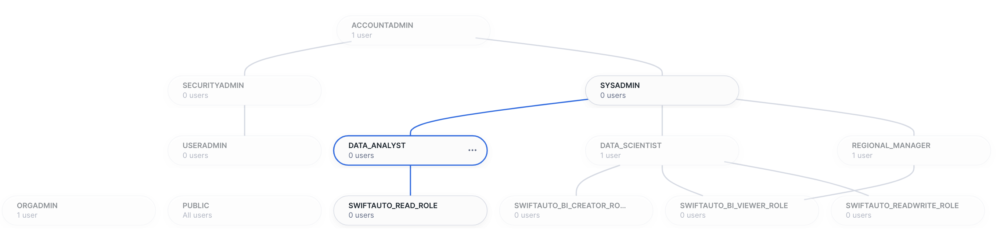
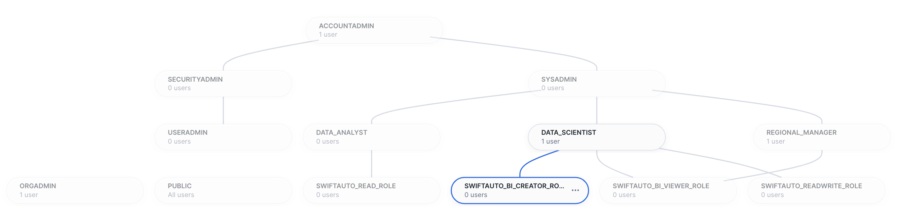
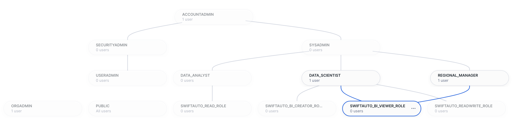

# Visualizing Car Sales and Dealer Profits Using Snowflake Snowsight


[](https://opensource.org/licenses/Apache-2.0)
[](https://shields.io/)
[](https://shields.io/)

## Disclaimer

This repository contains a project based on the final assignment for the **[BI Dashboards with IBM Cognos Analytics and Google Looker](https://www.coursera.org/learn/bi-dashboards-with-ibm-cognos-analytics-and-google-looker)** course on Coursera. The original assignment focused on creating and analyzing business intelligence (BI) dashboards/reports using IBM Cognos Analytics and Google Looker Studio.

For this project, I have adapted the assignment to utilize Snowflake's Snowsight. Additionally, I have provided a Streamlit app that produces the same visualizations using Streamlit-in-Snowflake (SiS).

### Usage

* You are welcome to use this repository as a reference or starting point for your own project.

* If you choose to fork this repository, please ensure that you comply with the terms of the Apache License and give proper credit to the original authors.

## Objectives

* Analyze the historical trends in car sales for SwiftAuto Traders.
* Provide insights on car sales and profits for each dealer.

## Project Scenario

SwiftAuto Traders has hired a data scientist to analyze car sales and profits for each dealer. Their first task is to create visualizations and present them as a dashboard to the regional manager.

## Project Layout

This repository contains all of the source files, scripts, output files, and guides for completing the final assignment using Snowflake Snowsight and Streamlit.

```text
├── Automotive_Industry               <- Automotive Industry Sample Data
│   ├── AU_Car_Models.csv             <- Contains information about individual car models
│   ├── AU_Car_Recalls.csv            <- Contains information about the number and type of safety recalls that affect the types of cars sold
│   ├── AU_Daily_Sales.csv            <- Contains information about daily automotive sales and weather at the time of the initial sales visit
│   ├── AU_Dealers.csv                <- Contains information about individual car dealers
│   ├── AU_Sales_By_Model.csv         <- Contains sales information
│   └── AU_Sentiment.csv              <- Contains information about customer sentiment
├── images                            <- Screenshot files used by the markdown files
├── Final_Assignment_Snowsight.md     <- Visualizing Car Sales and Dealer Profits Using Snowflake Snowsight Guide
├── Final_Assignment_Streamlit.md     <- Visualizing Car Sales and Dealer Profits Using Streamlit-in-Snowflake (SiS) Guide
├── requirements.txt                  <- Dependency items to be installed by pip
├── setup_swiftauto_traders.log       <- Output from setup_swiftauto_traders.py script
├── setup_swiftauto_traders.py        <- Python script to automate the setup of the Snowflake environment for this project
└── streamlit_swiftauto_traders.py    <- Single-page Streamlit in Snowflake app for SwiftAuto Traders
```

## Datasets

For this project, we will use a modified subset of the [Automotive Industry Sample Data](./Automotive_Industry/), which is available in this repository.

The original dataset can be found here: [Automotive Industry Sample Data](https://accelerator.ca.analytics.ibm.com/bi/?utm_source=skills_network&utm_content=in_lab_content_link&utm_id=Lab-IBMSkillsNetwork-DV0130EN-Coursera&perspective=authoring&pathRef=.public_folders%2FIBM%2BAccelerator%2BCatalog%2FContent%2FDAT00142&id=i22898C2A4DD748F79E0FC2BD017F4FE8&objRef=i22898C2A4DD748F79E0FC2BD017F4FE8&action=run&format=HTML&cmPropStr=%7B%22id%22%3A%22i22898C2A4DD748F79E0FC2BD017F4FE8%22%2C%22type%22%3A%22reportView%22%2C%22defaultName%22%3A%22DAT00142%22%2C%22permissions%22%3A%5B%22execute%22%2C%22read%22%2C%22traverse%22%5D%7D)

The terms of use are located at https://developer.ibm.com/terms/ibm-developer-terms-of-use/.

## Task Information
**Task 1**: Create a dashboard titled as `Sales` to capture the following KPI metrics:
* Capture Profit (formatted to 1 decimal place in millions of US dollars)
* Capture Quantity sold
* Create a bar chart to capture Quantity sold by model
* Capture Average quantity sold

**Task 2**: Develop a column chart to display Profit by Dealer ID in the `Sales` dashboard sorted in ascending order

**Task 3**: Create another dashboard titled as `Service` and capture the following KPI metrics as visualizations:
* Create a column chart to capture the number of recalls per model of car
* Create a treemap to capture the customer sentiment by comparing positive, neutral, and negative reviews
* Create a line and column chart to capture the quantity of cars sold per month compared to the profit
* Create a pivot table with heatmap to capture the number of recalls by model and affected system

**Task 4**: Share the dashboards

## Requirements

This project has the following requirements:

* Python 3.10.12 or higher
* pip 24.3.1 or higher
* A Snowflake user with `ACCOUNTADMIN` role granted. You can create a trial Snowflake account [here.](https://signup.snowflake.com/)
    * Select `Enterprise` for your Snowflake edition and `Amazon Web Services` for your cloud provider
    * Choose the region nearest you, accept the terms, and click `GET STARTED`
    * Go to your email, and click on the activation link

## Setup

The [setup_swiftauto_traders.py](./setup_swiftauto_traders.py) Python script has been provided to setup the Snowflake environment for this project. It also handles the uploading of CSV dataset files to stage, creates and loads tables with inferred schemas, and establishes a basic role hierarchy and user setup to demonstrate dashboard sharing within Snowflake.

**Install Snowflake Connector for Python**

Make sure you have Python (version 3.10.12 or later) and `pip` installed on your system. Then, install the required libraries using the provided `requirements.txt` file. The command syntax is:

```bash
python3 -m pip install -r requirements.txt
```

**Set Environment Variables for Snowflake Credentials**

Replace the placeholder values with your actual Snowflake account details when setting the environment variables.

*Bash (Linux/Mac)*
* Open Terminal
* Use the `export` command to set environment variables:
    ```bash
    export SNOWFLAKE_USER='your_username'
    export SNOWFLAKE_PASSWORD='your_password'
    export SNOWFLAKE_ACCOUNT='your_account'
    ```
    Alternatively, you can add the environment variables to your bash login script `.bash_profile` or `.bashrc` so they are automatically set when you log in.

*Windows*
* Open Command Prompt.
* Use the `setx` command to set environment variables:
    ```cmd
    setx SNOWFLAKE_USER "your_username"
    setx SNOWFLAKE_PASSWORD "your_password"
    setx SNOWFLAKE_ACCOUNT "your_account"
    ```
* Restart any open Command Prompt windows for the changes to take effect.

**Execute `setup_swiftauto_traders.py`**

```bash
python3 setup_swiftauto_traders.py
```
Output: [setup_swiftauto_traders.log](./setup_swiftauto_traders.log)

## Notes

After executing the provided [setup_swiftauto_traders.py](./setup_swiftauto_traders.py) Python script, your Snowflake environment will be configured with the following components.

### Database Objects
#### Tables
* The `SWIFTAUTO_DB.AUTOMOTIVE` namespace contains six tables:
    * `AU_CAR_MODELS`
    * `AU_CAR_RECALLS`
    * `AU_DAILY_SALES`
    * `AU_DEALERS`
    * `AU_SALES_BY_MODEL`
    * `AU_SENTIMENT`
* Table schemas are automatically inferred from the structure of the corresponding CSV file.
* To ensure compatibility and ease of use, column names containing spaces are replaced with underscores.


#### Stages
* The `SWIFTAUTO_DB.PUBLIC` namespace contains an `AUTOMOTIVE_INDUSTRY` stage with six CSV files:
    * `AU_Car_Models.csv`
    * `AU_Car_Recalls.csv`
    * `AU_Daily_Sales.csv`
    * `AU_Dealers.csv`
    * `AU_Sales_By_Model.csv`
    * `AU_Sentiment.csv`


#### File Formats
* The `SWIFTAUTO_DB.PUBLIC` namespace contains a `CSV_FF` file format with the following options:
    * Fields are separated by commas
    * The first row is used as column headers
    * Leading and trailing spaces are removed from fields
    * Fields may be optionally enclosed by double quotes
    * '\\N', 'NULL', '' values are treated as SQL NULL
    * Empty fields are inserted as SQL NULL
    * An error is raise if the number of columns in the file does not match the table schema


### Users & Roles
To properly demonstrate the sharing of Snowsight dashboards, the following role hierarchy and users were created, enabling the data scientist to present the dashboards to the regional manager as outlined in the project scenario.

| NAME | COMMENT |
|---|---|
| DS_JSMITH | Data Scientist, SwiftAuto Traders |
| RM_DENVER | Regional Manager, Denver, Colorado |
| DATA_ANALYST | Functional role for data analysts |
| DATA_SCIENTIST | Functional role for data scientists |
| REGIONAL_MANAGER | Functional role for regional managers |
| SWIFTAUTO_BI_CREATOR_ROLE | Access role that permits BI creator access for SWIFTAUTO_DB |
| SWIFTAUTO_BI_VIEWER_ROLE | Access role that permits BI viewer access for SWIFTAUTO_DB |
| SWIFTAUTO_READ_ROLE | Access role that permits read-only access for SWIFTAUTO_DB |
| SWIFTAUTO_READWRITE_ROLE | Access role that permits read-write access for SWIFTAUTO_DB |

#### Users
* Log in to Snowsight using the `DS_JSMITH` and `RM_DENVER` accounts with the password specified in the [setup_swiftauto_traders.py](./setup_swiftauto_traders.py) Python script.
* Users are required to change their password upon their first login to the system.
* Only users who have previously signed in to Snowsight can be assigned share permissions.


#### Functional Roles

*DATA_ANALYST*


*DATA_SCIENTIST*


*REGIONAL_MANAGER*


#### Access Roles

*SWIFTAUTO_BI_CREATOR_ROLE*


*SWIFTAUTO_BI_VIEWER_ROLE*



*SWIFTAUTO_READ_ROLE*


*SWIFTAUTO_READWRITE_ROLE*


## Final Assignment

Begin the [Final Assignment using Snowsight](./Final_Assignment_Snowsight.md)<br>
Begin the [Final Assignment using Streamlit-in-Snowsight](./Final_Assignment_Streamlit.md)

## Learner

[Pravin Regismond](https://www.linkedin.com/in/pregismond)

## Acknowledgments

* IBM Skills Network © IBM Corporation 2024. All rights reserved.